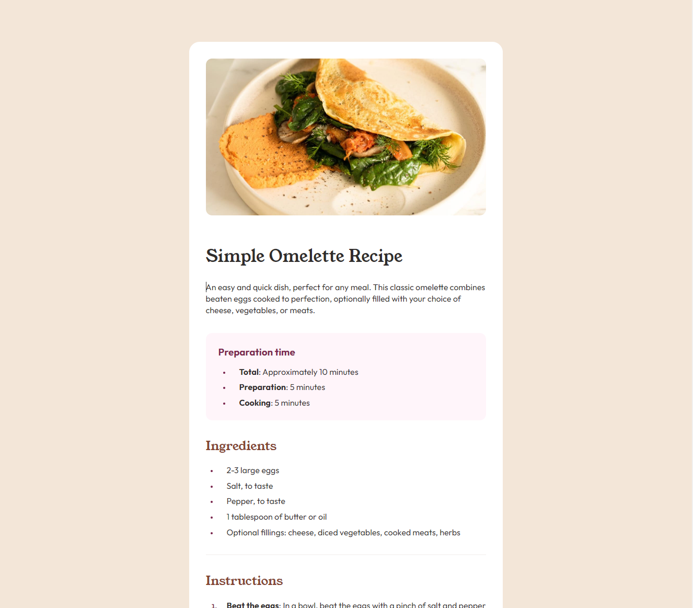

# Frontend Mentor - Recipe page solution

This is a solution to the [Recipe page challenge on Frontend Mentor](https://www.frontendmentor.io/challenges/recipe-page-KiTsR8QQKm). 

## Overview

### Screenshot

### Links

- Live Site URL: [AAA | Recipe Page](https://fem-recipepage.vercel.app/)

## My process

### Built with

- Semantic HTML5 markup
- CSS custom properties
- Flexbox
- Mobile-first workflow
- SASS for styles no pre-built components were used

## Author
- Website - [Ata Abatay](https://www.ataabatay.com)